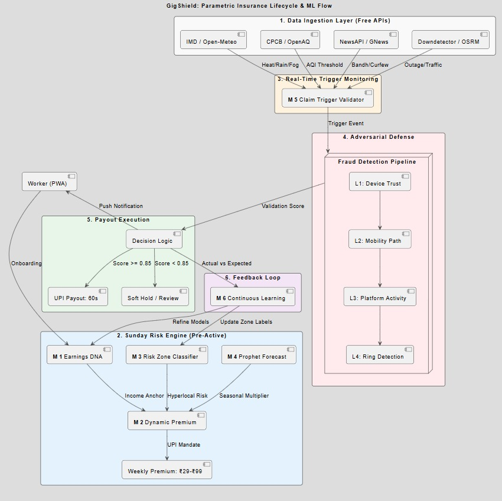

# 🛡️ GigShield: AI-Powered Parametric Insurance for Gig Economy Delivery Partners

[](#) [](#) 

> **Brief Pitch:** GigShield is a parametric insurance platform designed exclusively to protect the livelihoods of food delivery workers from uncontrollable external disruptions. We ensure that when the weather stops, their income doesn't.

# 👥 Persona & Scenario Analysis

## Why Food Delivery Workers?

India's **5–8 million food delivery workers** (Zomato, Swiggy) are the backbone of the urban digital economy — yet they are completely unprotected when external disruptions wipe out their income.

We chose this persona because no existing insurance product in India covers **income loss from weather, platform failures, or social disruptions.**
> When it rains → ₹0. App crashes → ₹0. Bandh called → ₹0. **We fix that.**

| Pain Point | The Reality |
|---|---|
| 💸 Fixed costs never pause | Bike EMI ₹2,800–3,200/month + fuel ₹180–220/day — due whether they work or not |
| 🎯 The incentive trap | One 2-hr rain event → miss weekly slab → lose ₹800 bonus on top of lost orders |
| ⚠️ No safety net | [90% have zero savings buffer](https://www.niti.gov.in/sites/default/files/2022-06/India_Gig_Economy_Report_27062022.pdf) ; [68% spend more than they earn](https://www.financialexpress.com/business/industry/) |
| 🌧️ Platforms profit, riders don't | Zomato charges 40% surge pricing in rain — [riders receive ₹0 extra](https://restofworld.org/2024/india-heat-wave-delivery-workers/) |

---

## 🗂️ 7 Scenarios — 3 Domains

> Every trigger uses **objective, third-party, government-verified data.** No forms. No calls. UPI payout in 60 seconds.

---

### 🌡️ Domain 1 — Extreme Weather

---

#### 🔴 Scenario 1 — Extreme Heat
> *"The sun is my boss, and it doesn't pay me."*

**Persona:** Devender Kumar, 31 · Swiggy · Delhi · Sole earner, family of 4

Temperatures crossed **50°C in Delhi in summer 2024** — the highest in 50 years. Devender cannot log off without losing his ₹180 daily incentive, so he rides for 7 hours in 48°C heat and nets ₹310 after fuel. No heat protection exists anywhere in India for gig workers.

📎 [Rest of World — India's heat wave and gig workers (2024)](https://restofworld.org/2024/india-heat-wave-delivery-workers/) · [IMD Heatwave Data](https://mausam.imd.gov.in/)

| Trigger | Payout | Source |
|---|---|---|
| IMD Red Alert + heat index ≥44°C for 2+ hrs in active shift | 70% of avg daily earnings, auto UPI | IMD + [Open-Meteo](https://open-meteo.com/) |

- Worker can log off safely -> Zero fraud risk — no one controls the sun -> 20+ yrs of IMD data for precise pricing

---

#### 🌧️ Scenario 2 — Heavy Rain & Flooding
> *"Platforms profit from the rain. We drown in it."*

**Persona:** Ravi Kumar, 28 · Zomato · Mumbai (Kurla) · Bike EMI ₹3,200/month

During Mumbai's monsoon, zone orders collapse 70% in 20 minutes while Zomato charges customers a 40% surge fee. Ravi earns ₹90 in his peak 3-hour window and misses his ₹800 weekly slab bonus — losing both base income and his incentive.

📎 [IMD Mumbai Rainfall Bulletins](https://mausam.imd.gov.in/) · [Gig Workers & Monsoon Income Loss — The Hindu](https://www.thehindu.com/news/cities/mumbai/mumbai-rains-affect-delivery-workers/)

| Trigger | Payout | Source |
|---|---|---|
| Rainfall ≥25mm/hr for 90+ min in rider's zone | 70% shift earnings + **Slab Shield** (missed bonus paid too) | IMD + [Open-Meteo](https://open-meteo.com/) |

* Slab Shield is unique — covers the bonus cascade loss no other product addresses · * Minute-level IMD data, fully tamper-proof

---

#### 🌫️ Scenario 3 — Dense Winter Fog
> *"The app timer counts down. The road disappears."*

**Persona:** Arjun Mishra, 24 · Zomato · Lucknow · Remits ₹5,000/month to family

Visibility: 30 metres. Delivery timer: 18 minutes. Slow down → rating drops. Speed up → accident risk. Arjun has no financial reason to choose safety. The All India Gig Workers Union demanded *"withdrawal of fast delivery mandates in fog"* in their December 2025 strike charter — platforms did not respond.

📎 [AIGWU Strike Charter, Dec 2025](https://thelogicalindian.com/swiggy-zomato-blinkit-delivery-workers-on-nationwide-strike-key-demands-new-years-eve-disruptions/) · [IMD Fog Bulletins](https://mausam.imd.gov.in/imd_latest/contents/fog-bulletins.php)

| Trigger | Payout | Source |
|---|---|---|
| IMD Dense Fog advisory + visibility <100m for 3+ hrs during shift | Half-shift income (7–11 PM window) | [IMD Fog Bulletins](https://mausam.imd.gov.in/imd_latest/contents/fog-bulletins.php) |

* First product in India that pays a rider to make the safe choice ->  40–60 fog days/winter in North India = predictable risk pool

---

#### 😷 Scenario 4 — Severe Air Pollution (AQI)
> *"I breathe in what others drive away from."*

**Persona:** Delivery workers across Delhi-NCR — 10–12 hrs/day in hazardous air

Delhi's AQI breaches 400 (Severe) for weeks every winter. Workers keep riding to avoid losing daily incentives, accumulating respiratory damage with no compensation. CPCB data is real-time, city-specific, and freely accessible — a perfect parametric trigger.

📎 [CPCB AQI Data Portal](https://cpcb.nic.in/) · [WHO Report on Air Pollution & Outdoor Workers](https://www.who.int/news-room/fact-sheets/detail/ambient-(outdoor)-air-quality-and-health)

| Trigger | Payout | Source |
|---|---|---|
| CPCB AQI ≥400 for 3+ consecutive hours | Health Safety Supplement — partial shift income | [CPCB API](https://cpcb.nic.in/) (free, hourly) |

* Government-published, updated hourly, city-specific ->  Worker can reduce hours without a financial penalty

---

### 🏙️ Domain 2 — Social & Infrastructure Disruptions

---

#### 🚫 Scenario 5 — Unplanned Bandh / Curfew
> *"A bandh can be declared at any time. There is no protection."*

**Persona:** Priya Devi, 34 · Swiggy · Chennai · Part-time (4–9 PM) · Child's school fees due

A flash bandh at 4:45 PM — no warning. Restaurants close. Orders vanish. Priya earns ₹150 instead of ₹600 and misses her child's ₹1,200 school fee. In December 2025, ~1 lakh workers lost full-day income on Christmas and New Year's Eve due to strikes and platform disruptions. Compensation paid: ₹0.

📎 [Nationwide Strike — Dec 31, 2025](https://thelogicalindian.com/swiggy-zomato-blinkit-delivery-workers-on-nationwide-strike-key-demands-new-years-eve-disruptions/) · [Bandh Impact on Gig Workers — Economic Times](https://economictimes.indiatimes.com/tech/technology/gig-workers-loss/)

| Trigger | Payout | Source |
|---|---|---|
| NewsAPI: 'bandh'/'curfew' confirmed in 3+ sources **AND** zone orders drop ≥65% | Full declared shift income | [NewsAPI](https://newsapi.org/) + platform mock |

* **Dual-source = zero fraud** — you can't fake a national news event AND a platform-wide order collapse ·  Fully automated

---

#### 🚧 Scenario 6 — Metro / Construction Congestion
> *"I'm stuck in traffic. The timer is running. I'm earning nothing."*

**Persona:** Delivery workers near Metro corridors — Mumbai, Delhi, Bengaluru, Chennai

Active Metro construction has added 25–40 minutes to last-mile delivery routes across major corridors. Riders spend 40–60% more time per delivery but earn the same flat rate. Income per hour drops silently — with no disruption event they can report.

📎 [Mumbai Metro Route Impact on Traffic — Times of India](https://timesofindia.indiatimes.com/city/mumbai/metro-construction-traffic/) · [Delhi Metro Phase 4 Delays](https://www.hindustantimes.com/cities/delhi-news/)

| Trigger | Payout | Source |
|---|---|---|
| Traffic API: avg travel time >200% of historical mean for rider's hub | Per-hour Congestion Supplement | Google Maps / HERE Maps (mock API) |

* Route-level travel history is objectively verifiable -> First product to treat chronic congestion as an insurable income event

---

### 📱 Domain 3 — Platform Reliability

---

#### 💀 Scenario 7 — Platform App Outage
> *"The app was down for 4 hours. Zomato made a tweet. I made ₹0."*

**Persona:** Mohammed Rizwan, 29 · Zomato · Mumbai (Andheri) · Peak target ₹800–950/evening

Zomato's server went down on a Friday evening in October 2021 — peak dinner rush. 3.5 lakh riders were online. Collective income loss: estimated ₹70–140 crore. Platform response: one social media post. Rider compensation: ₹0. Multiple outages have occurred since with no structural fix.

📎 [Zomato Outage — India.com, Oct 2021](https://www.india.com/news/india/breaking-zomato-server-down-due-to-outage-customers-face-issue-while-ordering-food-5075873/) · [Downdetector India](https://downdetector.in/)

| Trigger | Payout | Source |
|---|---|---|
| [Downdetector](https://downdetector.in/): 500+ reports in 15 min + outage >45 min during peak hours | Hourly rate × confirmed outage duration | Downdetector API (independent) |

* Fully independent of Zomato/Swiggy — cannot be manipulated ·  No claim form, no chatbot — money lands automatically

---


<div align="center">

> **The GigShield Principle:** Every payout is triggered by objective, third-party, government-verified or publicly monitored data. The worker never has to prove anything. The insurer never has to investigate anything. The algorithm pays — instantly, fairly, automatically.
</div>


## 2. ⚖️ Coverage Scope & The Golden Rules
* ✅ **Income Loss Protection Only:** This platform is strictly designed as a safety net for lost hours and unearned wages due to external events.
* 🚫 **Exclusions:** We strictly exclude any coverage for health issues, life insurance, accidents, or vehicle repairs.


---
# 💰 Weekly Premium & Payout Model

> A **risk-adjusted, income-based** micro-insurance framework — affordable, dynamic, and ML-powered.
> Premiums are computed **every Sunday** and debited **every Monday at 9 AM** via UPI auto-mandate.

---

## Why Weekly?

Gig workers earn and spend weekly — not monthly or annually. A ₹500/month product feels like a debt. A ₹69/week product feels like a choice.

| Traditional Insurance | GigShield |
|---|---|
| Annual or monthly premium | **Weekly** — aligned with earnings cycle |
| Fixed price, always | **Dynamic** — cheaper in safe weeks |
| Claim form + wait | **Auto-payout** — 60 seconds, no form |
| One-size payout | **Income-anchored** — based on your actual earnings |


---

## 🧮 How Premium Is Calculated — 3 Steps

### Step 1 — Base Premium
```
Base Premium = Weekly Income × Base Rate (1.5% – 2%)
```
Anchored to the worker's **declared weekly earnings** at onboarding.
ML cross-checks against zone average to prevent inflation.

> 📊 Real earnings baseline (Zomato/Swiggy 2025): ₹102/hr average · ₹2,800–6,500/week depending on hours

---

### Step 2 — Risk Multipliers
```
Adjusted Premium = Base Premium × City Risk × Shift Factor × Platform Factor × Zone Factor
```

| Multiplier | Range | Driven By | Updates |
|---|---|---|---|
| 🏙️ City Risk | 0.85× – 1.40× | IMD zone history + CPCB AQI records | Monthly |
| 🌙 Shift Factor | 0.85× – 1.20× | Peak-hour vs morning shift exposure | At onboarding |
| 📱 Platform Factor | 1.00× – 1.10× | Outage frequency per platform | Weekly |
| 📍 Zone Factor | 0.80× – 1.30× | Hyperlocal flood / congestion history | Weekly |

---

### Step 3 — Affordability Cap
```
Final Premium = min(max(Adjusted Premium, ₹29), ₹99)
```

**Hard floor ₹29** — always affordable, even for part-time workers.
**Hard ceiling ₹99** — never more than ~2.5% of a full-time weekly income.

---

## 💸 Payout Calculation

```
Daily Income    = Weekly Income ÷ 7
Daily Payout    = Daily Income × Coverage % (60% – 80%)
Max Weekly Payout = Daily Payout × Max Trigger Days (3)
```

### Coverage Tiers

| Tier | Weekly Premium | Coverage | Triggers Covered | Max Weekly Payout |
|---|---|---|---|---|
| 🟡 Basic | ₹29 – ₹49 | 60% daily income | Any 3 of 7 | ~₹720 |
| 🔵 Standard ✦ | ₹49 – ₹79 | 70% daily income | All 7 + Slab Shield | ~₹1,400 |
| 🔴 Full Shield | ₹79 – ₹99 | 80% daily income | All 7 + Platform Bridge | ~₹2,400 |

> **Slab Shield** — unique to GigShield. If a disruption knocks the rider below their weekly incentive threshold, the missed platform bonus is added to the payout. No other product in India covers this.

---

## 🔁 Dynamic Premium Adjustment (Weekly Recalibration)

```
New Premium = Old Premium × (Actual Loss / Expected Loss)
```

- Actual loss > expected → premium nudges up next week
- Actual loss < expected → premium nudges down next week
- Change is capped at ±15% per week to avoid premium shock

This means a dry, uneventful week in November **costs less**. A monsoon week in July **costs more**. Workers see exactly why on Sunday morning.

---

## 🤖 ML-Powered Expected Loss Engine

```
Expected Loss = f(Rain, AQI, Zone Risk, Shift Pattern, Historical Claims, Seasonality)
```

| Model | Role | Data Source |
|---|---|---|
| **XGBoost** | Weekly risk score per zone | 10+ yrs IMD + CPCB + claims history |
| **Prophet** | Disruption probability forecast | IMD 7-day forecast + seasonal index |
| **Isolation Forest** | Fraud / anomaly detection | GPS + claim pattern analysis |

**Every Sunday, the pipeline runs:**

```
1. Pull forecasts  →  IMD, CPCB, IOC fuel prices, Downdetector history
2. Score zones     →  XGBoost outputs risk score 0.0 – 1.0 per scenario
3. Forecast week   →  Prophet: if P(trigger) > 0.4, seasonal multiplier rises
4. Compute premium →  Apply all factors, clamp ₹29–99, write to DB by 6 AM
5. Notify worker   →  "Rain likely Wed–Thu. Your cover this week: ₹74. You're protected."
6. Auto-debit      →  UPI mandate fires Monday 9 AM. Policy live instantly.
```

---

## ⚡ Trigger → Payout in 60 Seconds

```
API Data (every 15 min)
        ↓
Threshold Check  →  Does event meet trigger criteria?
        ↓
Fraud Engine     →  GPS active in zone? No anomaly? No duplicate?
        ↓
Confidence Score →  ≥ 0.85  →  Auto-approve & pay via UPI
                 →  < 0.85  →  Human review queue (2-hr SLA)
        ↓
Worker notified: "₹680 credited to your UPI. Stay safe."
```

No form. No call. No waiting.
## 🛡️ Insurer Guardrails — Staying Sustainable

| Guardrail | How It Works |
|---|---|
| **3-day payout cap** | Max 3 trigger events paid per rider per week |
| **Zone pool model** | Riders in same zone share a weekly pool; reinsurance backstop covers overflow |
| **Adverse selection lock** | Tier upgrades blocked 24 hrs before a forecast trigger fires |
| **3-day waiting period** | Weather claims: 3-day wait for new policyholders. Outage claims: none. |
| **Income anchor** | Payout based on onboarding-declared income, not same-day self-report |
| **Target loss ratio** | 55–65% — standard for parametric micro-products globally |

---

<div align="center">

**The GigShield Premium Promise**

*Pay ₹29–₹99 this week.*
*If disruption hits — ₹280 to ₹2,400 lands in your wallet.*
*Automatically. Instantly. No paperwork.*

</div>


---
# 🚨 Adversarial Defense & Anti-Spoofing Strategy
### GigShield's Response to the Market Crash Crisis

---

> **The Attack:** 500 delivery workers. GPS-spoofing apps. Fake locations inside a 
> weather red-zone. Mass false payouts. Liquidity pool drained in minutes.
>
> **The Problem:** Simple GPS verification is dead.
>
> **Our Answer:** GPS is one weak signal. We require five.

---

## Why GPS Alone Fails

A spoofing app can fake coordinates. It cannot simultaneously fake:
- A clean, untampered device environment
- A believable delivery route *into* the zone
- Recent active delivery work
- Plausible travel time from the last real platform event
- Normal behavior across 500 workers at once

Our system requires **signal consistency across all layers** before any payout fires.

---

## The Four Defense Layers

### Layer 1 — Device Trust
*Before trusting location, trust the device.*

- Detects mock-location flags, rooted/tampered devices, emulators
- Uses Android Play Integrity / app attestation
- Flags abnormal location provider switches

A spoofing app almost always leaves traces here. If the device environment is 
compromised, GPS output is rejected outright.

---

### Layer 2 — Mobility Authenticity  
*Did this worker actually travel into the zone?*

- Analyzes last 15–30 min of GPS telemetry, not just current location
- Detects teleport jumps (impossible speed between pings)
- Matches route against real road network
- Uses accelerometer/gyroscope as soft motion corroboration

**A spoofer can fake a point. Faking a full believable delivery trajectory is hard.**

---

### Layer 3 — Operational Eligibility
*Was this worker actually working when disruption hit?*

- Checks active delivery session, recent order acceptance, last pickup/drop-off state
- Verifies last trusted platform event timestamp and location
- Checks travel-time plausibility from last confirmed point to claimed zone

A worker sitting at home with no active trip and no recent delivery activity 
**does not qualify**, regardless of what GPS says.

---

### Layer 4 — Ring Detection
*Individual spoofing is hard to catch with certainty. Mass coordinated fraud is obvious.*

Detects coordinated syndicates by looking for:
- 500 workers becoming eligible within the same short window
- Shared device fingerprints or payout account linkages
- Synchronized "teleport-into-zone" patterns with no platform-side disruption evidence
- Suspicious geohash concentration at zone edges

> If there's a real flood, there's also a real cancellation spike, real merchant 
> impact, real trip stalls. A syndicate has none of these. That absence is the signal.

---

## Data Points Used (Beyond GPS)

| Category | What We Collect | Why It Matters |
|---|---|---|
| Device integrity | Mock-location flag, attestation score, root detection | Catches tampered environments |
| Trajectory | 15–30 min telemetry, speed, heading, road-match confidence | Catches location jumps |
| Motion | Accelerometer + gyroscope summaries | Corroborates physical movement |
| Network | Network type, signal strength, cell info | Cross-checks physical location |
| Platform activity | Active trip status, last delivery event, timestamp | Confirms actual work exposure |
| Travel plausibility | Distance + time from last trusted point | Flags physically impossible movement |
| Weather context | Red-alert polygon, rainfall intensity, road closures | Verifies a real event is occurring |
| Worker baseline | 4-week behavioral history, usual zones and hours | Detects deviation from personal norm |
| Ring linkage | Shared devices, UPI accounts, IPs, synchronized timing | Detects coordinated syndicates |

---

## The Fraud Scoring Pipeline
```
Device Trust Score
      +
Mobility Authenticity Score        →   Payout Risk Score   →   Decision
      +
Operational Eligibility Score
      +
Ring / Cluster Risk Score
```

**Stack used:** Rule engine (fast deterministic checks) + LightGBM fraud model 
(tabular features, handles missing data well) + graph-based cluster detection 
(community detection for ring identification).

No single model. No single signal. Consistent multi-layer evidence required.

---

## Three-Tier Payout Response

### ✅ Tier 1 — Auto Approve *(majority of legitimate cases)*
All signals consistent. Device clean. Route plausible. Active trip confirmed. 
Weather verified. Payout fires in under 2 minutes.

*Worker notification: "Severe weather confirmed in your zone. ₹290 credited."*

---

### ⏳ Tier 2 — Soft Hold *(honest workers with bad weather signal issues)*
Temporary uncertainty — weak GPS accuracy, brief network drop, delayed telemetry 
sync. **No action required from the worker.** System waits 10–15 minutes for 
signals to stabilize or cached data to sync.

*Worker notification: "Your payout is being verified. Usually resolves within 15 minutes."*

> This tier exists specifically because honest workers in heavy rain will have 
> degraded signals. Missing data ≠ fraud. Only contradictory evidence escalates.

---

### 🔴 Tier 3 — Quarantine *(strong contradictory evidence)*
Low device trust + impossible route jump + no active trip + high ring-risk cluster 
association. Payout is **held, not denied**. Routed to secondary review.

*Worker notification: "Your payout is under quick review. We'll update you shortly."*

No worker is permanently rejected by algorithm alone. Every Tier 3 flag gets 
human review.

---

## Liquidity Pool Circuit Breaker

If the engine detects an abnormal eligibility spike with strong ring-risk signals 
concentrated in a micro-zone, suspicious clusters are shifted from instant payout 
to staggered/held payout **at the cluster level only**.

Honest workers outside the suspicious cluster are never blocked.
The pool is protected before it drains, not after.

---

## What This Stops

| Attack vector | How GigShield blocks it |
|---|---|
| GPS spoofing app | Device trust layer rejects tampered environments |
| Plausible fake coordinates | No delivery activity or route history to match |
| Single sophisticated spoofer | Multi-signal scoring requires consistent evidence |
| 500-person coordinated ring | Ring detection isolates cluster before payout fires |
| Honest worker flagged by mistake | Soft hold + human review prevents false denial |

---

## Implementation Scope

**Hackathon MVP (what we build):**
- Rule-based spoof checks + device trust flags
- Route continuity and teleport detection
- LightGBM fraud scoring on tabular features
- Basic graph clustering for ring detection
- Three-tier payout workflow with soft hold
- Liquidity circuit breaker

**Production additions (post-hackathon):**
- LSTM trajectory scoring for deeper path realism
- Advanced graph feature engineering
- Stronger network-layer enrichment

---

*GPS spoofing beats a GPS-only system. It does not beat five independent signal 
layers that all have to agree before a rupee leaves the pool.*

---
# 🧠 AI & Machine Learning Architecture

> GigShield's intelligence layer does three things: **price risk fairly each week**, **predict disruptions before they hit**, and **validate every trigger before a payout fires**.
> Every model is purpose-built for our 7 confirmed scenarios. Every model retrains weekly on real outcomes.
> **Every data source is free, open, or government-published — zero paid API dependency.**

---

```
┌──────────────────────────────────────────────────────────────────────┐
│                       GIGSHIELD ML PIPELINE                          │
│                                                                      │
│  Real-world data  →  6 models  →  Decisions  →  Payouts             │
│  (IMD, CPCB, GPS,    (Sunday)     (real-time)    (UPI, 60 sec)      │
│   all free APIs)                                                     │
└──────────────────────────────────────────────────────────────────────┘
```


## The Six Models

---

### 1 · Earnings DNA Profiler — `Gradient Boosted Regressor`

**What it does:** Builds a personalised income fingerprint for every rider at onboarding — the anchor for every payout calculation.

```
Earnings DNA = f(Shift window, Avg daily orders, Zone, Platform,
                 Weekly slab tier, Historical earnings variance)
```

- Estimates the rider's true average daily income — used as the payout base
- Detects if declared income is an outlier vs zone-average (fraud guard at source)
- Powers the **Slab Shield**: predicts whether a disruption will push the rider below their weekly bonus threshold and adds that amount to the payout

> Without this model, every payout is a flat guess. With it, Ravi in Mumbai gets exactly the payout his disrupted evening shift warranted — not a generic ₹200.

---

### 2 · Dynamic Premium Engine — `XGBoost`

**What it does:** Estimates expected income loss per rider per week and converts it into a fair, personalised premium.

```
Expected Loss = f(Weather risk, AQI risk, Fog probability, Zone risk,
                  Shift timing, Platform factor, Historical claims,
                  Congestion index, Seasonality)
```

- Trained on 10+ years of IMD, CPCB, and disruption event data — all freely available
- One model, all 7 scenarios — each scenario's signals are separate feature columns
- Outputs a weekly risk score (0.0 → 1.0) that drives the premium multiplier
- Runs every **Sunday at midnight** — premium confirmed in DB by **6 AM**

| Scenario | Key Feature Columns | Free Data Source |
|---|---|---|
| 🌡️ Extreme Heat | `heat_index_forecast`, `imd_red_alert_flag` | Open-Meteo + IMD |
| 🌧️ Heavy Rain | `rainfall_mm_hr_forecast`, `zone_flood_history` | Open-Meteo + IMD |
| 🌫️ Dense Fog | `fog_advisory_flag`, `visibility_forecast_m` | IMD fog bulletins |
| 😷 Severe AQI | `cpcb_aqi_forecast`, `aqi_severe_days_trailing_4wk` | CPCB + OpenAQ |
| 🚫 Bandh / Curfew | `city_bandh_frequency_ytd`, `political_event_calendar` | GNews API (free) |
| 🚧 Congestion | `avg_travel_time_pct_above_baseline`, `active_construction_zones` | OSRM (open-source) |
| 💀 Platform Outage | `platform_downtime_hrs_trailing_4wk`, `downdetector_spike_flag` | Downdetector (free) |

---

### 3 · Risk Zone Classifier — `Random Forest`

**What it does:** Labels every delivery zone 🟢 Low / 🟡 Medium / 🔴 High risk for the coming week — hyperlocal pricing, not city-wide averages.

| Input Feature | Scenario | Free Source |
|---|---|---|
| Rainfall + flood history (3yr) | Rain, Fog | IMD historical archive |
| AQI breach frequency (seasonal) | Severe AQI | CPCB / OpenAQ |
| Fog advisory days per winter | Dense Fog | IMD fog bulletin archive |
| Bandh / curfew event history | Bandh / Curfew | GNews API scraped history |
| Road congestion vs OSRM baseline | Congestion | OSRM (open-source routing) |
| Platform outage frequency by city | Platform Outage | Downdetector history |
| Heat index exceedance days per summer | Extreme Heat | Open-Meteo historical |

A rider in Kurla (Mumbai) near a flood-prone zone pays a different premium than one in Powai — same city, different zone label.

---

### 4 · Disruption Prediction Model — `Prophet`

**What it does:** Forecasts the probability of each of the 7 triggers firing in the next 7 days.

```
P(trigger, week) > 0.40  →  seasonal multiplier rises
                          →  Sunday rider alert fires
                          →  uninsured riders nudged to subscribe
```

**Why Prophet (not LSTM):** Prophet works well from day one with limited data using explicit seasonality components. LSTM requires large sequential datasets a new platform won't have at launch. Prophet's yearly, weekly, and holiday effects are a natural fit for our scenario types.

Prophet captures per scenario:
- 🌡️ **Heat** — May–June yearly peak, IMD red-alert streaks
- 🌧️ **Rain** — monsoon windows (Jun–Sep), zone-level flood recurrence
- 🌫️ **Fog** — Nov–Feb North India season, visibility decay patterns
- 😷 **AQI** — Oct–Jan Delhi-NCR smog season
- 🚫 **Bandh** — political event calendar, day-of-week frequency patterns
- 🚧 **Congestion** — Metro construction phase timelines, morning/evening peaks
- 💀 **Outage** — platform incident history, day-of-week and peak-hour patterns

Sunday notification to Arjun in Lucknow:
> *"Dense fog likely Wednesday night. Evening cover active. Your premium this week: ₹54."*

---

### 5 · Claim Trigger Validator — `Rule engine + ML hybrid`

**What it does:** Confirms every real-world event meets the trigger threshold before any payout fires. Each scenario has its own rule set — all using free APIs.

```
Step 1 — Hard threshold check  (rule-based, instant)
         S1 Heat:       IMD Red Alert + Open-Meteo heat index ≥ 44°C for 2+ hrs
         S2 Rain:       Open-Meteo rainfall ≥ 25mm/hr for 90+ min in zone
         S3 Fog:        IMD Dense Fog advisory + visibility < 100m for 3+ hrs
         S4 AQI:        CPCB / OpenAQ AQI ≥ 400 for 3+ consecutive hours
         S5 Bandh:      GNews API 'bandh'/'curfew' in 3+ sources
                        AND platform order-drop ≥ 65% (mock API)
         S6 Congestion: OSRM travel time > 200% of zone historical mean
         S7 Outage:     Downdetector 500+ reports AND outage > 45 min peak hrs

Step 2 — Dual-source confirmation  (≥ 2 independent sources must agree)
         Prevents a single API failure from misfiring a payout

Step 3 — ML confidence score  (0.0 – 1.0 across all signals)
         Score ≥ 0.85  →  Auto-approve · UPI fires in 60 sec
         Score < 0.85  →  Human review queue · 2-hr SLA
```

> S5 (Bandh) is the most complex — GNews keyword signal **and** platform order-drop must both fire. Neither alone is sufficient. This is what makes social disruption claims fraud-proof.

---

### 6 · Continuous Learning Loop — `Weekly retraining`

**What it does:** Closes the feedback loop — actual payouts teach all models what they got wrong.

```
New Premium ∝ Actual Loss / Expected Loss  (per zone, per scenario)

Actual loss > expected  →  risk score nudges up next week
Actual loss < expected  →  risk score nudges down next week
Change capped at ±15%   →  no premium shock week-to-week
```

Every Sunday the pipeline ingests for each of the 7 scenarios:
- Which triggers fired, in which zones, for how many riders
- Were Prophet forecasts close to actual event frequency?
- Which zones had the largest prediction error? (targeted retraining)
- Did new congestion zones emerge from OSRM delta? (Random Forest update)

Over time **basis risk shrinks** — the gap between predicted and actual tightens every monsoon, every fog winter, every heatwave summer.

---

<div align="center">

*Every scenario has a model. Every model has a free data source.*
*Every Sunday, the whole system gets a little more accurate.*

</div>


## 6. Platform Strategy: Web vs Mobile

**Decision:** Mobile-First Progressive Web App (PWA)

---

### Justification

Delivery partners operate entirely on smartphones in real-time, on the move. Requiring a native app download introduces friction, storage constraints, and onboarding delays.

A mobile-first PWA provides the best balance between accessibility and functionality:

- No installation required — instant onboarding via link
- Works on low-end Android devices with slow networks
- Can be added to the home screen for an app-like experience
- Supports push notifications for disruption alerts and payout confirmations
- Lightweight and optimized for gig worker usage patterns

---

### Web vs Mobile Trade-off

| Feature | Native App | PWA |
|---------|-----------|-----|
| Installation Required | Yes | No |
| Performance | High | High (optimized) |
| Offline Support | Yes | Partial |
| Push Notifications | Yes | Yes |
| Development Time | High | Low |
| Accessibility | Limited | Universal (via URL) |

---

### Platform Design

- **Worker Interface** — Mobile PWA (primary usage)
- **Admin Dashboard** — Desktop Web (analytics and monitoring)

---

### Strategic Advantages

- Eliminates onboarding friction, leading to higher adoption
- Faster deployment with no app store dependency
- Seamless updates with no action required from the user
- Ideal for demo and production — instant access via URL
  

## 7. Technical Stack

---

### Frontend

| Technology | Purpose |
|------------|---------|
| React.js + Vite | Component-based UI with fast builds |
| Tailwind CSS | Responsive, mobile-first styling |
| PWA | App-like experience without installation |
| React Query | Data fetching and client-side caching |

---

### Backend & API Layer

| Technology | Purpose |
|------------|---------|
| Node.js + Express | Core application logic and API orchestration |
| FastAPI (Python) | ML model serving and inference endpoints |
| JWT Authentication | Secure session handling |

---

### AI / ML Engine

| Model / Tool | Purpose |
|--------------|---------|
| XGBoost | Dynamic premium calculation and risk scoring |
| Prophet / LSTM | Time-series disruption prediction |
| Isolation Forest | Anomaly detection and fraud prevention |
| scikit-learn | Core ML utilities and pipelines |
| MLflow | Experiment tracking and model versioning |

---

### External APIs & Data Sources

| API | Data Provided |
|-----|--------------|
| Open-Meteo | Weather data (rain, heat index) |
| CPCB / OpenAQ | Air quality index (AQI) |
| NewsAPI | Bandh and curfew detection |
| Downdetector (mocked) | Platform outage signals |
| Zomato / Swiggy (mocked) | Order volume and drop signals |
| GPS Activity Feed (mocked) | Rider activity validation |

---

### Database & Caching

| Technology | Purpose |
|------------|---------|
| PostgreSQL | Structured storage for users, policies, and claims |
| Redis | Real-time trigger caching and fast lookups |

---

### Payments & Integrations

| Service | Purpose |
|---------|---------|
| UPI / Razorpay (sandbox) | Instant payout simulation |
| DigiLocker API | KYC verification |

---

### Authentication & Security

| Technology | Purpose |
|------------|---------|
| Firebase Auth | User authentication |
| JWT Tokens | Secure API communication |

---

### Infrastructure & Deployment

| Tool | Purpose |
|------|---------|
| Docker | Containerized deployment |
| GitHub Actions | CI/CD pipeline |
| Render / Railway | Backend hosting and deployment |

## 🚀 Workflow Block Diagram

## 📌 6-Week Development Plan

A structured roadmap to build a **parametric, AI-driven income protection system** for gig workers, covering design, development, automation, and deployment.

---

### 🔹 Weeks 1–2 (Phase 1: Ideation & Foundation)

- Define **target personas** (e.g., Zomato/Swiggy delivery partners)
- Identify key **income disruption scenarios**:
  - Rainfall, heatwaves, AQI, bandh, platform outages
- Design **end-to-end system architecture**:
  - PWA frontend, backend APIs, ML pipeline
- Plan core modules:
  - Registration, pricing engine, trigger system, claims, dashboard
- Define **weekly premium model**:
  - Income-based pricing + risk multipliers
- Plan AI/ML integration:
  - Risk scoring (premium calculation)
  - Disruption prediction
  - Fraud detection strategy
- Design database schema (users, policies, triggers, payouts)
- Set up GitHub repository and project structure
- Create initial **README documentation**
- Record a **2-minute idea explanation video**

---

### 🔹 Weeks 3–4 (Phase 2: Development & Automation)

- Build **user onboarding & KYC module**
- Implement **insurance policy management system**
- Develop **dynamic premium calculation engine** (ML-based)
- Integrate **mock APIs**:
  - Weather (rain, temperature)
  - AQI (air quality)
  - News (bandh/curfew)
  - Platform outage signals
- Implement **parametric trigger engine**:
  - Rainfall threshold
  - Heat index threshold
  - AQI threshold
  - Bandh detection
  - App outage detection
- Develop **automated claim triggering system** (no manual input)
- Implement **basic fraud checks**:
  - GPS validation
  - Activity verification
- Build **worker dashboard (basic UI)**:
  - Premium, coverage, payout status
- Ensure **end-to-end flow works**:
  - Trigger → auto claim → payout simulation
- Record a **2-minute functional demo video**

---

### 🔹 Weeks 5–6 (Phase 3: ML Integration & Optimization)

- Implement **advanced fraud detection system**:
  - GPS spoofing detection
  - Device trust validation
  - Route/mobility analysis
  - Duplicate & anomaly detection (Isolation Forest / LightGBM)
  - Basic cluster/ring detection
- Integrate **instant payout simulation**:
  - Razorpay sandbox / UPI mock
- Build **analytics dashboards**:
  - Worker view: earnings protected, active coverage
  - Admin view: risk insights, claims, fraud flags
- Optimize **UI/UX for mobile-first PWA**
- Implement **real-time trigger validation system**
- Add **confidence scoring + multi-signal verification**
- Simulate real-world scenarios:
  - Rain event → trigger → auto payout
  - Bandh → order drop → payout
- Improve performance and reliability
- Finalize **AI model integration & tuning**

---

### 🚀 Final Deliverables

- Fully functional **Progressive Web App (PWA)**
- AI-driven **dynamic premium calculation system**
- Real-time **parametric trigger engine**
- Automated **claim & payout system (no manual claims)**
- Fraud detection & validation pipeline
- Demo scenarios (rain, bandh, outage)
- Complete **README documentation**
- **5-minute demo video**
- **Final pitch deck (business + AI + pricing model)**

---


## 🎥 Demo Video

- [Explanation Video](https://studio.youtube.com/video/mlTOR74VyU4/edit)
- [ Prototype ](https://www.youtube.com/watch?v=mlTOR74VyU4)
